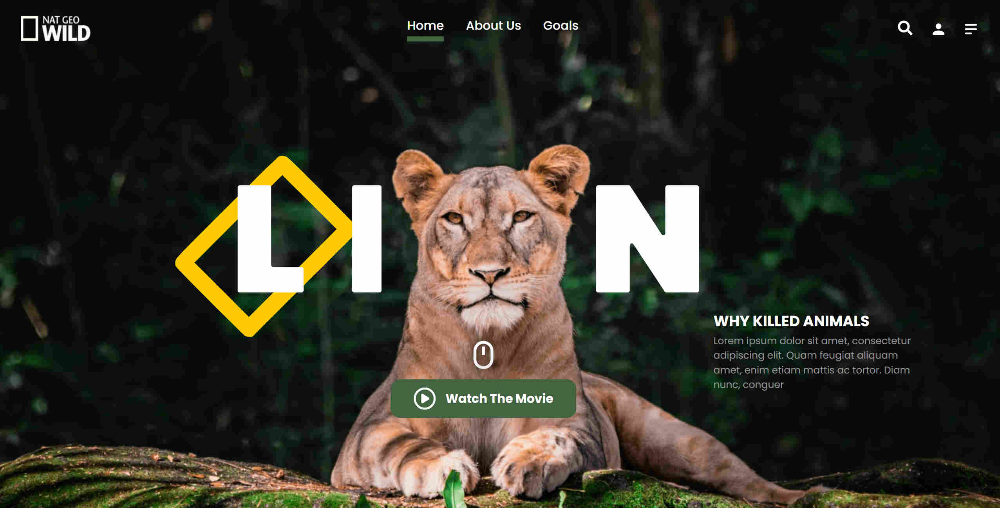

# «LION» 2022

## Проект ноябрьского марафона "Заверстаю" по верстке от HTML Academy
( легкая сложность / статика / паралакс )

 

### Ссылка на GH-PAGES: https://navfront.github.io/Lion-Marathon-Project/

 

- BEM
- WEBP
- RETINA-images
- SVG-sprites
- A11y

 

### Тех. задание:
 - Кроссбраузерность:
   - Chrome: последняя стабильная версия.
   - Firefox: последняя стабильная версия.
   - Safari: последняя стабильная версия (для студентов с macOS).

### Общие требования:
 - Страница статическая. Адаптив делать не нужно. Размер 1920px x 1080px
 - Кнопка «Watch the movie» открывает модальное окно с видео: https://youtu.be/8E1rITSQBeo. Реализовывать не нужно.
 - Все иконки, кроме «бургерного меню», ведут на другие страницы. Делать другие страницы не нужно. 
 - Все интерактивные элементы, кнопки и ссылки, должны иметь подпись, например, с помощью класса visually-hidden.
 - Логотип Nat Geo Wild ведёт на главную страницу сайта разработчика — https://htmlacademy.ru/
 - Нужно реализовать состояния всех интерактивных элементов (:hover, :focus) при наведении ссылки должны окрашиваться в цвет #406343. Плюсом будет настройка плавной смены цвета с помощью transition.
